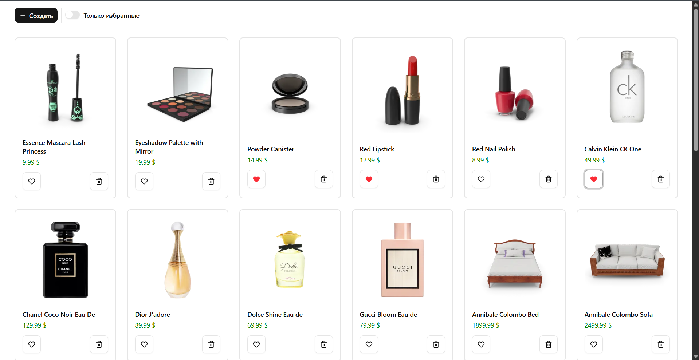
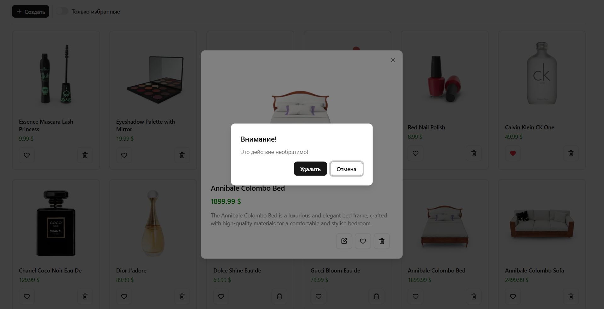
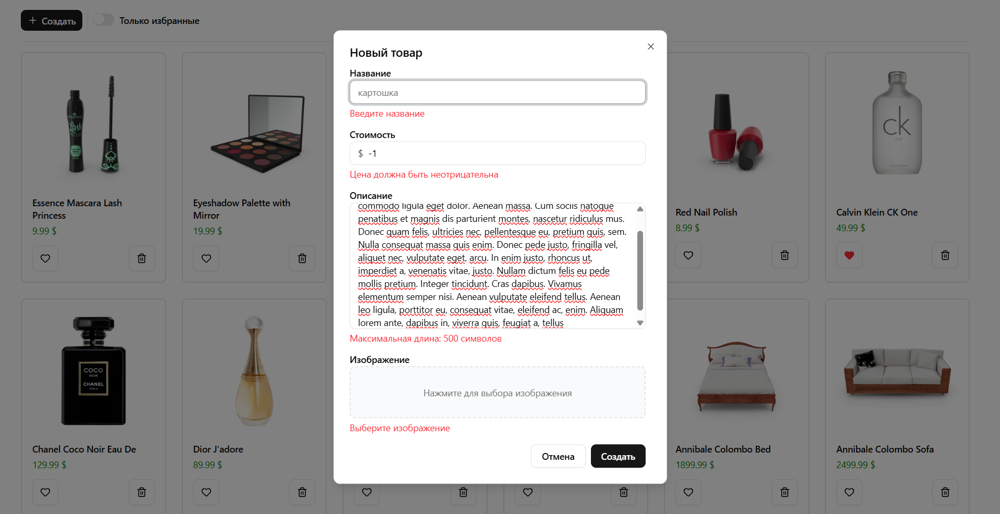

# Тестовое задание для Экосистемы Альфа

Приложение для работы с каталогом товаров.

## Стек
- React
- TypeScript
- Vite
- Redux Toolkit + RTK Query
- React Hook Form
- shadcn/ui (Radix + Tailwind)
- React Router

## Routing
- `/products` — список
- `/products/:id` — страница товара
- `/products/:id/edit` — редактирование товара
- `/products/create-product` — создание товара

## Дополнительный функционал
- Редактирование товара
- Всплывающие подсказки к действиям
- Защита от случайного удаления товара
- Страницы просмотра, создания и редактирования товара в виде модальных окон
- Адаптивное отображение для любого соотношения сторон 

## 📈 Скриншоты

  
   
  <em>Главная страница со списком товаров.</em>

  
   
  <em>Страница товара и подтверждение удаления.</em>

  
   
  <em>Создание нового товара и валидация формы.</em>

  
  
   
  <em>Адаптивное отображение на мобильных устройствах, редактирование товара и просмотр избранных.</em>

## 

## 🎮 Развернутое приложение

👉 [Запустить онлайн](https://oseniy.github.io/alfaTestTask/)  
