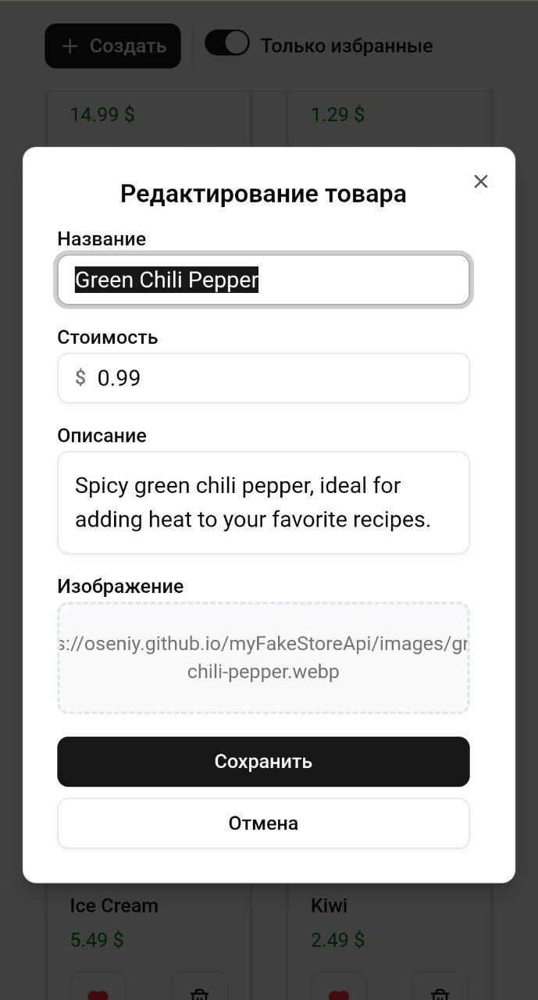
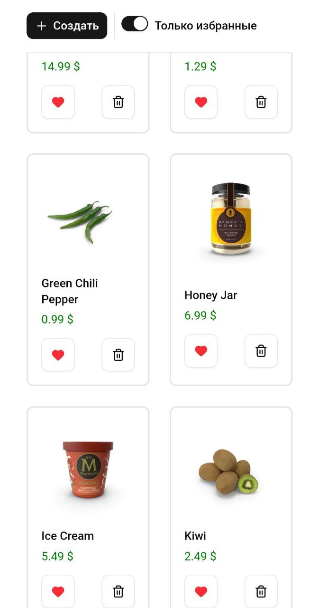

# Тестовое задание для Экосистемы Альфа

Приложение для работы с каталогом товаров.

## Стек
- React
- TypeScript
- Vite
- Redux Toolkit + RTK Query
- React Hook Form
- shadcn/ui (Radix + Tailwind)
- React Router

## Routing
- `/products` — список
- `/products/:id` — страница товара
- `/products/:id/edit` — редактирование товара
- `/products/create-product` — создание товара

## Дополнительный функционал
- Редактирование товара
- Всплывающие подсказки к действиям
- Защита от случайного удаления товара
- Страницы просмотра, создания и редактирования товара в виде модальных окон
- Адаптивное отображение для любого соотношения сторон 

## 📈 Скриншоты

<!-- 

  
  
    

 -->

## 

## 🎮 Развернутое приложение

👉 [Запустить онлайн](ссылка)  
